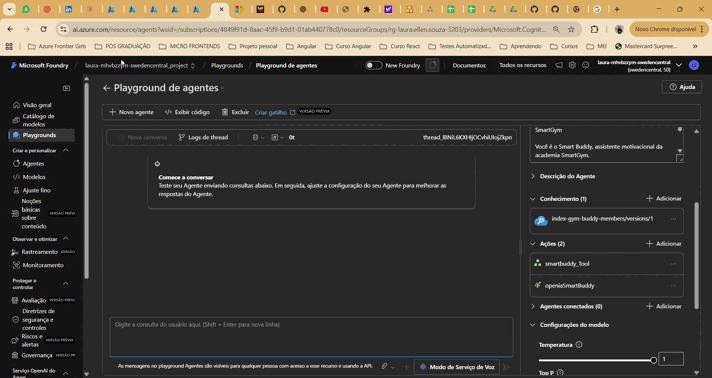
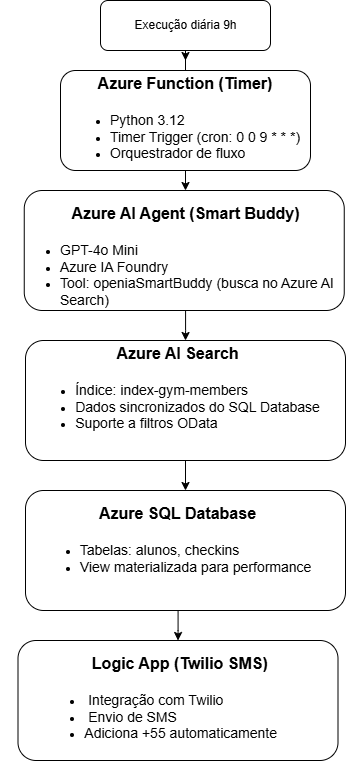

# 🏋️ Smart Buddy - Agente Motivacional SmartGym

[](https://ai.azure.com/)
[](https://www.python.org/)
[](https://azure.microsoft.com/services/functions/)
[](https://openai.com/)

Sistema automatizado de engajamento de alunos usando **Azure AI Agent**, que identifica aniversariantes e padrões de frequência para enviar mensagens motivacionais personalizadas via SMS.

---

## 🎯 Visão Geral

### O que faz?

✅ **Identifica** automaticamente aniversariantes do dia  
✅ **Detecta** alunos com baixa frequência (precisam motivação)  
✅ **Reconhece** alunos dedicados (alta frequência)  
✅ **Envia** mensagens personalizadas via SMS  
✅ **Executa** automaticamente todos os dias às 6h  

### Problema Resolvido

Academias enfrentam:
- ❌ Baixo engajamento de alunos
- ❌ Alto índice de cancelamentos
- ❌ Falta de comunicação personalizada
- ❌ Processos manuais demorados

### Solução

✨ Automação completa com IA  
✨ Mensagens personalizadas em linguagem natural  
✨ Análise inteligente de padrões de frequência  
✨ Integração multi-cloud (Azure + Twilio)  

---

## 🤖 Agent em Ação



*Agent entende linguagem natural, busca dados no AI Search via tool `openiaSmartBuddy` e retorna JSON estruturado*


*Resultado real: mensagem de aniversário recebida no aplicativo de mensagens do celular*

> 💡 **Como funciona na prática:** A **Azure Function gym-engagement-function** executa automaticamente todos os dias às 6h, fazendo exatamente o que você vê no GIF acima: envia perguntas ao Agent ("busque aniversariantes", "busque baixa frequência"), recebe os dados em JSON e dispara mensagens via SMS para cada aluno.

---

## 🏗️ Arquitetura



### Componentes Principais

| Componente | Tecnologia | Função |
|------------|------------|--------|
| **Timer** | Azure Function (Python 3.12) | Execução diária (6h) |
| **Agent IA** | Azure AI Foundry (GPT-4o Mini) | Busca inteligente em linguagem natural |
| **Busca** | Azure AI Search | Índice de dados + filtros OData |
| **Database** | Azure SQL Database | Armazenamento de alunos e check-ins |
| **SMS** | Logic App + Twilio | Envio de mensagens SMS |

---

## 📚 Documentação Completa

### 🚀 [Guia de Setup e Instalação](docs/SETUP.md)
Como configurar todo o ambiente Azure do zero:
- Criação dos recursos Azure
- Configuração do AI Agent
- Setup do banco de dados
- Integração com Twilio

### 🔧 [Arquitetura e Componentes](docs/ARCHITECTURE.md)
Detalhes técnicos da solução:
- Diagrama de arquitetura detalhado
- Fluxo de dados passo a passo
- Descrição de cada componente
- Integrações entre serviços

### 📊 [Banco de Dados](docs/DATABASE.md)
Estrutura de dados:
- Schema das tabelas
- Queries importantes
- Tabela materializada
- Performance e indexação

### 🤖 [Azure AI Agent](docs/AGENT.md)
Assistente inteligente GPT-4o Mini:
- System instructions
- Tools configuradas
- Exemplos de uso
- Playground tests

### 🔍 [Azure AI Search](docs/SEARCH.md)
Índice de busca de alunos:
- Schema do índice
- Indexer configuration
- Filtros OData
- Performance

### ⚡ [Azure Function - Orquestrador](docs/FUNCTION-GYM-ENGAGEMENT.md)
Timer trigger diário:
- Timer configuration (cron)
- Application settings
- Monitoramento

**📦 Código fonte:** [github.com/Lauraellen/gym-engagement-function](https://github.com/Lauraellen/gym-engagement-function)

### 🔧 [Azure Function - openiaSmartBuddy](docs/FUNCTION-OPENIA-SMARTBUDDY.md)
Tool do Agent para busca de dados:
- HTTP trigger
- Queries OData
- Exemplos de request/response

**📦 Código fonte:** [github.com/Lauraellen/func-gym-search](https://github.com/Lauraellen/func-gym-search)

### 📱 [Logic App + Twilio](docs/LOGIC-APP.md)
Envio de mensagens SMS:
- Workflow configuration
- Twilio integration
- Phone format (+55)
- Runs history

---

## ✨ Funcionalidades

### 🎂 Mensagens de Aniversário
```
🎉 Feliz Aniversário, Maria! 
A equipe da academia deseja um dia incrível! 
Hoje o treino é especial! 💪
```

### 📉 Motivação (Baixa Frequência)
```
Oi João! Sentimos sua falta aqui na academia! 😊
Que tal voltar hoje? Seu corpo agradece! 🏋️
```

### 📈 Reconhecimento (Dedicados)
```
Parabéns Ana! 🏆 Você treinou 22 vezes este mês!
Continue essa dedicação incrível! 💪🔥
```

---

## 🛠️ Tecnologias

### Azure Services
- Azure Functions (Python 3.12)
- Azure AI Foundry (GPT-4o Mini)
- Azure AI Search
- Azure SQL Database
- Azure Logic Apps
- Application Insights

### Integrações
- Twilio (WhatsApp/SMS)
- Azure OpenAI

---

## 🚀 Quick Start

### Pré-requisitos
- Conta Azure com créditos
- Python 3.12+
- Azure CLI
- Conta Twilio
---

📖 **[Guia completo de instalação →](docs/SETUP.md)**

---

## 📊 Resultados

### Métricas de Exemplo (Execução Diária)
```json
{
  "data_execucao": "19/11/2025",
  "aniversariantes": {
    "total": 3,
    "enviados": 3
  },
  "baixa_frequencia": {
    "total": 12,
    "enviados": 12
  },
  "dedicados": {
    "total": 8,
    "enviados": 8
  },
  "total_mensagens": 23
}
```

## 📄 Licença

Este projeto está sob a licença MIT. Veja o arquivo [LICENSE](LICENSE) para mais detalhes.

---

## Autor

<h4 align="center">
    
    
</h4>
<h4 align="center">
    <b style="margin-right: 30px">Laura Ellen 🚀</b>

</h4>

## 📚 Documentação Adicional

- [Setup Completo](docs/SETUP.md)
- [Arquitetura Detalhada](docs/ARCHITECTURE.md)
- [Estrutura do Banco](docs/DATABASE.md)

*Última atualização: 19/11/2025*
